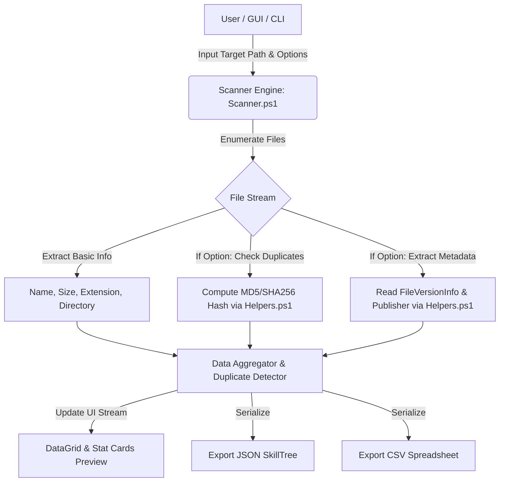

# 🏛️ Architecture & System Design - Scan Me!

เอกสารนี้อธิบายสถาปัตยกรรมระบบ การไหลของข้อมูล (Data Flow) และโมเดลข้อมูลของโปรเจกต์ **Scan Me!**

---

## 1. System Overview & Layering

ระบบแบ่งการทำงานออกเป็น 4 ชั้นหลักอย่างชัดเจน (Modular Architecture):

```
+----------------------------------------------------------------+
|                       Presentation Layer                       |
|   MainWindow.xaml (WPF Modern Dark UI) + MainWindow.ps1       |
+----------------------------------------------------------------+
                               |
                               v
+----------------------------------------------------------------+
|                        Execution Engine                        |
|   src/engine/Scanner.ps1 (Recursive Scanning & Pipeline)       |
+----------------------------------------------------------------+
                               |
                               v
+----------------------------------------------------------------+
|                        Utilities Layer                         |
|   src/utils/Helpers.ps1 (MD5/SHA256, Metadata, CSV/JSON IO)   |
+----------------------------------------------------------------+
                               |
                               v
+----------------------------------------------------------------+
|                      Data & Storage Layer                      |
|   config/default_config.json  |  output/*.json  |  output/*.csv|
+----------------------------------------------------------------+
```

---

## 2. Component Responsibility

| Layer / Component | ไฟล์หลัก | หน้าที่และความรับผิดชอบ |
| :--- | :--- | :--- |
| **GUI Frontend** | `src/gui/MainWindow.xaml` | ออกแบบส่วนประสานงานผู้ใช้ด้วย XAML รองรับ Responsive Grid, Stat Cards, DataGrid, แถบกรอง และธีม Fluent Dark |
| **GUI Controller** | `src/gui/MainWindow.ps1` | จัดการ UI Event Loop, การเชื่อมต่อกับ Scanner Engine, การแสดงความคืบหน้า (Progress Bar) และการ Save File Dialog |
| **Scanner Engine** | `src/engine/Scanner.ps1` | ค้นหาไฟล์แบบ Recursive, กรองตามนามสกุล, สร้าง Category/Relative Path, คำนวณสถิติภาพรวม |
| **Helper Utilities** | `src/utils/Helpers.ps1` | คำนวณ Checksum Hash (MD5/SHA256), ดึง VersionInfo จากไฟล์ `.exe`/`.msi`, จัดฟอร์แมตขนาดไฟล์ และบันทึก UTF-8 |
| **Configuration** | `config/default_config.json` | บันทึกค่า Preset และ User Preferences เพื่อโหลดใช้งานซ้ำ |
| **Data Output** | `output/*.json`, `output/*.csv` | ไฟล์ผลลัพธ์โครงสร้างมาตรฐานสำหรับนำไปวิเคราะห์ต่อหรือส่งให้ AI / App อื่น |

---

## 3. Data Flow Diagram



---

## 4. Key Performance Decisions

1. **Non-Blocking File Enumeration**: ใช้ `Get-ChildItem -LiteralPath ... -File -Recurse` เพื่อความเร็วสูงสุดบนระบบไฟล์ NTFS / ReFS และรองรับไฟล์ที่มีสัญลักษณ์พิเศษ
2. **Selective Feature Toggles**: การคำนวณ Hash และการดึง VersionInfo ถูกแยกเป็น Switch Option ทำให้การสแกนโฟลเดอร์ขนาดใหญ่ที่มีหลายแสนไฟล์ทำได้อย่างรวดเร็ว
3. **UTF-8 Standard Encoding**: ป้องกันปัญหาภาษาไทยและอักขระพิเศษในชื่อโฟลเดอร์/ไฟล์เสียหายเมื่อนำผลลัพธ์ไปใช้งานต่อบนแพลตฟอร์มอื่น (Web, Python, Linux)
